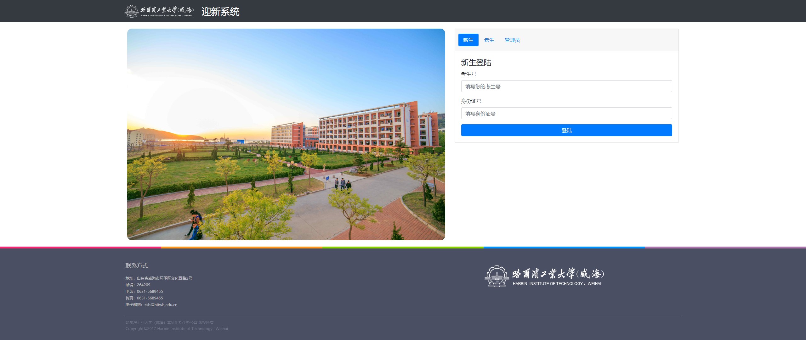
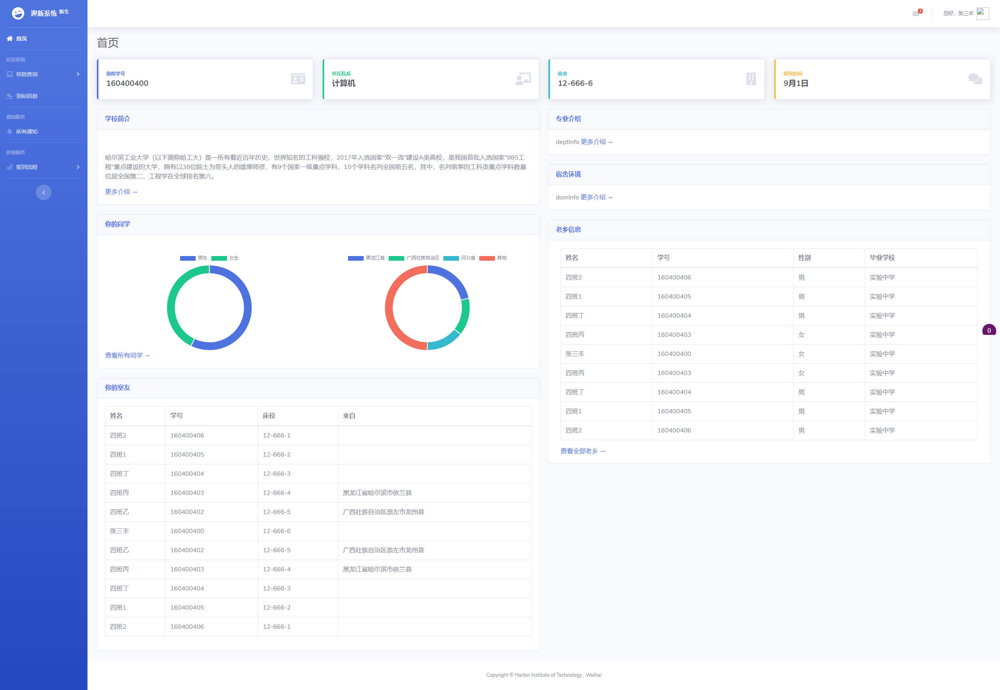
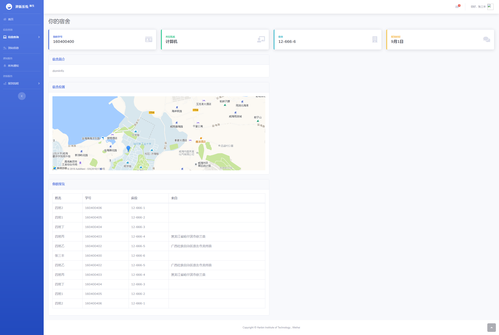
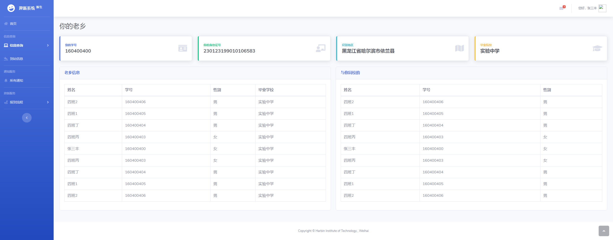
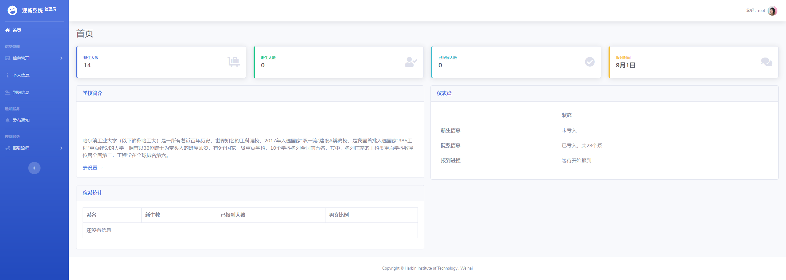

# 新生入学迎新系统

[](https://app.codacy.com/app/specialpointcentral/welcome?utm_source=github.com&utm_medium=referral&utm_content=1604104se-hitwh/welcome&utm_campaign=Badge_Grade_Dashboard) [](https://www.travis-ci.com/1604104se-hitwh/welcome) [](https://github.com/1604104se-hitwh/welcome/blob/master/LICENSE)

Welcome HITers

:warning:此版本仅仅是用于SE的大作业，可能不会有后续更新，请谨慎使用

## 项目说明

### 简介

为提高学校自动化办公水平，提高新生入学效率，开发新生入学迎新系统。

系统向**新生**提供：

- 学生信息查询  
- 服务数据收集  
  - 表单数据  
  - 接车预约数据  
- 关键信息通知  
- 到校信息提示  
- 迎新引导  

等服务；

系统向**在校生**提供：

- 新生信息查询（同乡）

等服务；

系统向**管理员**提供：

- 学生信息发布  
- 服务数据收集  
  - 表单数据  
  - 接车预约数据  
- 信息通知发布  
  - 到校信息发布  
  - 迎新信息发布  
- 迎新核验  
- 部分大数据分析  

等服务。

### 希望解决的问题

- 信息通知不及时

- 问卷统计不方便

- 报到流程不清楚

- 学生情况不明确

总之解决新生从录取到报到完成的一体化流程，让现场报到更加快捷方便，同时也能让新生更好地了解学校，学校也能更加方便的了解报到状态。

### 希望还能实现

- 财务系统对接，学杂费用在线缴纳

- 统一认证服务，实现报到前熟悉统一认证服务

- 信息推送，包括短信和微信平台自动推送

## 项目配置

- 后端采用Laravel框架，前端采用Bootstrap。再次感谢框架作者给我们开发带来便利。  
- 前后端数据交互部分采用Pjax模式，尽量减少页面刷新的次数。  
- 前端会采用多种开源库，之后可能会有nprogrss和sweetalert2。  
- 软件遵循GPL，若使用其他框架或库有更严格copyright要求，按照最严格执行。  

## 基础配置

运行环境建议：

- [x] PHP >= 7.1（推荐使用7.2以上）  
- [x] Laravel >= 5.6  
- [x] Mysql >= 5.6  
- [x] Curl  
- [ ] Opcache  
- [ ] NGINX >= 1.13  
- [ ] HTTP/2  
- [ ] 优秀的云主机  

## 开发环境配置

- 要求本地装有`composer`

```php
git clone https://github.com/1604104se-hitwh/welcome.git
cd Welcome
composer install
cp .env.example .env
```

之后需要打开`.env`配置本地的数据库环境

```php
DB_CONNECTION=mysql // 可能是别的数据库，具体见Laravel
DB_HOST=127.0.0.1   // 数据库地址
DB_PORT=3306        // 端口
DB_DATABASE=数据库名称
DB_USERNAME=数据库用户名
DB_PASSWORD=数据库密码
```

- Run `php artisan key:generate`

数据表迁移：

```php
php artisan migrate             //若之前没有表结构，则执行这条指令
    php artisan migrate:refresh //否则使用这条指令--Drop all tables and re-run all migrations
    php artisan migrate:rollback//若只希望回滚迁移全部数据表，则执行这条指令
php artisan key:generate                                // 生成密钥
```

数据填充：

```php
php artisan db:seed --class=DatabaseSeeder              // 随机生成许多学生数据
```

调试运行：

```php
php artisan serve
```

打开浏览器，地址栏输入：`localhost:8000`

登录数据可以在相应的数据库填充器中查看，比如管理员登录就可以在`database/seeds/AdminTableSeeder.php`中选取用户名密码登录

## 生产环境配置

- 使用`Nginx`中间件，需要将入口导向`public`，`index.php`会将流量引导到内核和路由；  
- 删除`.env`，在`config`中进行修改配置；  
- 关闭`debug`模式，进入生产模式。  

## 已实现部分功能展示

- 登录界面



- 新生界面



- 新生查询宿舍信息



- 新生查询老乡



- 管理员界面



- 管理员添加学生和院系信息

- 管理员添加学校简介

## 暂定实现功能

1. 个人信息查询

- 学号  
  - 学号  
  - 班级  
  - 院系与专业  
  - 班内人员及信息  
  - 班级群信息  
- 宿舍  
  - 室友信息  
  - 宿舍位置  
  - 宿舍环境  
- 老乡  
  - 老乡信息  
  - 老乡毕业学校  
  - 老乡群信息  

2. 通知服务

   可以发布通知，及时通知学生迎新信息。或者对学校的概况进行普及。同时允许各院系针对各院学生进行通知。

3. 接车服务

- 出行提示及到站登记

  提供出行提示，方便新生到达后选择合适的到校方式。

  同时提供预约功能，新生可以预约迎新接送车辆，方便学校统计大致人数。


4. 问卷系统（待定）

   效仿本部，新生进入迎新系统后需要完成招生办设计的调查问卷，后续管理员可以通过导出数据进行数据分析，减少后续发放纸质版再统计的麻烦。

5. 报到流程

   提供报到的流程指示，通过引导的方式（可提供此步到下一步的路线图等信息），方便新生快速完成报到。

6. 迎新核验

   向各院系提供，在迎新核验时候提供学生的核验信息，在核验完成后确认报到。

*Welcome HITers Software Development Team*

W.H.S.D.T.
